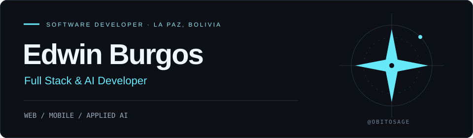
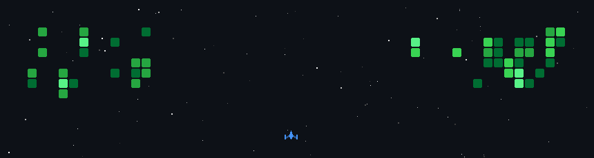

<!-- Profile layout: local banner, Skill Icons stack, and Shields.io contact badges. -->

  

### Building useful products for the web, mobile & beyond.

I connect **React interfaces**, **TypeScript backends** and **applied AI**. 
Computer Systems Engineering student at **UPB** · La Paz, Bolivia 🇧🇴

  
  
  

---

### Stack

  

  <b>TypeScript · React · NestJS · Node.js · Python · FastAPI · PostgreSQL · Docker</b>

  

  Mobile: React Native · Expo · Kotlin &nbsp; / &nbsp; AI: RAG · Transformers · pgvector 
  Also working with JavaScript, HTML/CSS, GitHub Actions and NVIDIA NIM.

---

### Selected projects

#### 01 / [AMI — Asistente de Trámites Bolivia](https://github.com/ObitoSage/superAMI)

A conversational backend that helps people navigate Bolivian government procedures, using retrieval-augmented generation over an open dataset.

**Python · FastAPI · PostgreSQL / pgvector · NVIDIA NIM**  
[Explore the code ↗](https://github.com/ObitoSage/superAMI)

#### 02 / [VoluntariadoUPB](https://github.com/ObitoSage/VoluntariadoUPB)

A mobile app built with a team to connect UPB students with volunteering opportunities, applications and participation tracking.

**React Native · Expo · TypeScript · Firebase**  
[Explore the code ↗](https://github.com/ObitoSage/VoluntariadoUPB) · 

---

### Beyond the code

- **Two hackathon wins in 2026:** April FinTech Challenge (Incubatec · Solydes · UPB) and Solutions for My City (Municipal Government of La Paz).
- **Currently exploring:** retrieval quality, RAG and AI backends for real products.
- **Design matters:** I use Figma and design thinking to connect interfaces with what people need.

<b>Education & languages</b>

 

**B.S. in Computer Systems Engineering**  
Universidad Privada Boliviana (UPB), La Paz · 2023–Present

**Languages:** Spanish (native) · English (high-intermediate)  

<b>My contributions, as a space shooter</b>

 

---

  Have an idea involving <b>web, mobile or AI</b>? Let's talk. 
  <a href="mailto:burgosovaleedwin@gmail.com">Email</a> · <a href="https://www.linkedin.com/in/edwin%C2%A0josue-burgos-ovale-16204a3b5/">LinkedIn</a>

